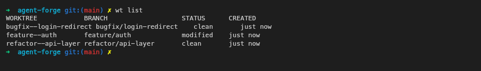
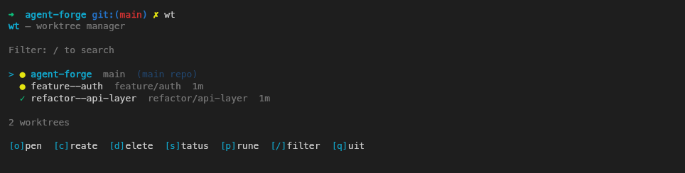
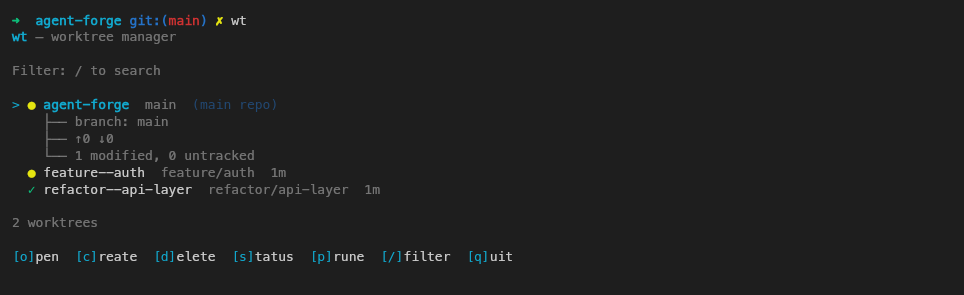
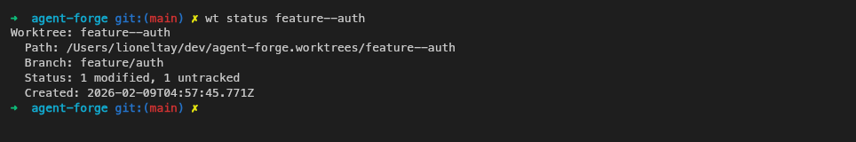

# Worktree Manager

A CLI for managing git worktrees. Create isolated worktrees with a single command, track their status, and clean up stale ones.

Git worktrees let you have multiple branches checked out simultaneously — each in its own directory, sharing the same git history. No re-cloning, instant creation, minimal disk usage. `wt` wraps git's built-in worktree support with a better interface: automatic directory management, status tracking, ignored file handling, a TUI, and bulk cleanup.



## Install

```bash
npm install -g @lioneltay/worktree-manager
```

## Quick Start

```bash
# Optional: initialize config with default ignored file rules
wt init

# Create a worktree on a new branch
wt create -b feature/auth

# Create a worktree from an existing branch
wt create feature/auth

# List all worktrees
wt list

# Check status
wt status

# Clean up
wt remove feature--auth
```

## Interactive TUI

Run `wt` with no arguments to launch the interactive terminal UI.



Keyboard shortcuts:

| Key | Action                   |
| --- | ------------------------ |
| `o` | Open worktree in editor  |
| `c` | Create new worktree      |
| `d` | Delete selected worktree |
| `s` | Toggle status details    |
| `p` | Prune stale worktrees    |
| `/` | Filter worktrees         |
| `q` | Quit                     |

Press `s` to expand inline status for the selected worktree:



The `o` key opens the worktree in your configured editor (see [Configuration](#configuration)). If no editor is configured, it prints the worktree path instead.

## Commands

### `wt init`

Set up a `.wt.json` config file with default ignored file rules (`.env` → symlink, `.env.local` → copy, `node_modules/` → ignore). This is optional — `wt create` works without it, but without a config file no ignored files will be handled.

### `wt create [options] <branch>`

Create a new worktree. Automatically detects whether the branch is local or remote.

| Option             | Description                                                       |
| ------------------ | ----------------------------------------------------------------- |
| `-b, --new-branch` | Create a new branch instead of checking out existing              |
| `--from <base>`    | Base commit/branch for new branch (default: HEAD)                 |
| `--name <folder>`  | Override folder name (default: branch with `/` replaced by `--`)  |
| `--copy-all`       | Copy all ignored files instead of using per-file mode from config |
| `--no-ignored`     | Skip ignored file handling entirely                               |
| `--meta <json>`    | Custom JSON metadata to write to `.worktree-meta.json`            |

When a worktree is created, `wt` copies or symlinks untracked files (like `.env`, `node_modules/`) according to the rules in `.wt.json`. See [Configuration](#configuration).

### `wt list [options]`

List all worktrees with their branch, status, and creation time.

| Option        | Description              |
| ------------- | ------------------------ |
| `--json`      | Output as JSON           |
| `-q, --quiet` | Only show worktree names |

### `wt status [worktree]`

Show worktree status. Omit the name to see a summary of all worktrees. Pass a name for full details including path, branch, upstream ahead/behind, modified files, untracked files, and creation date.



| Option   | Description    |
| -------- | -------------- |
| `--json` | Output as JSON |

### `wt remove <worktree>`

Remove a worktree and clean up git references. Refuses to remove worktrees with uncommitted changes unless `--force` is passed.

| Option        | Description                                |
| ------------- | ------------------------------------------ |
| `-f, --force` | Force remove even with uncommitted changes |

### `wt prune [options]`

Remove stale worktrees in bulk. Automatically skips worktrees with uncommitted changes (with a warning).

| Option           | Description                        |
| ---------------- | ---------------------------------- |
| `--stale <days>` | Remove worktrees older than N days |
| `--dry-run`      | Preview what would be removed      |

## Configuration

Running `wt init` creates a `.wt.json` config file in your repository root with sensible defaults. You can also create this file manually. If no config exists, `wt create` still works but skips ignored file handling.

### Local overrides

Create a `.wt.local.json` file for personal settings like `open` that shouldn't be committed. Local values override `.wt.json`. Add `.wt.local.json` to your `.gitignore`.

```json
{
  "ignoredFiles": {
    ".env": "symlink",
    ".env.local": "copy",
    "node_modules/": "ignore"
  },
  "editor": "code"
}
```

### `ignoredFiles`

Git worktrees only contain tracked files — untracked files like `.env` and `node_modules/` won't exist in new worktrees. This setting lets you list specific files and choose how to bring them into new worktrees.

Each entry maps a file path to a mode:

| Mode        | Behavior                                                   |
| ----------- | ---------------------------------------------------------- |
| `"symlink"` | Create a symlink from the worktree to the main repo's file |
| `"copy"`    | Copy the file from the main repo into the worktree         |
| `"ignore"`  | Do nothing — the file won't exist in the worktree          |

Use `"symlink"` for files that should stay in sync (e.g. `.env`), `"copy"` for files that might diverge (e.g. `.env.local`), and `"ignore"` for large directories you'll regenerate (e.g. `node_modules/`).

Keys can include glob patterns. `*` matches any run of characters within a single path segment and `?` matches a single character, so `ai/skills/_*` or `packages/*/config.json` are both valid. Each match inherits the mode from its pattern.

These rules can be overridden per-create with `--copy-all` (force copy mode for everything) or `--no-ignored` (skip all ignored file handling).

### `editor`

The command used to open worktrees from the TUI when pressing `o`. Set this to your editor's CLI command:

```json
{
  "editor": "code"
}
```

Common values: `"code"` (VS Code), `"cursor"` (Cursor), `"zed"` (Zed), `"vim"`, `"nvim"`. If not set, pressing `o` prints the worktree path instead.

## How It Works

### Directory Structure

Worktrees are stored in a sibling companion directory next to your repo. For example, if your repo is at `~/dev/my-project`, worktrees live at `~/dev/my-project.worktrees/`:

```
~/dev/my-project/                    # main repo
~/dev/my-project/.wt.json            # config file
~/dev/my-project.worktrees/          # companion directory
  .metadata.json                     # worktree registry (creation times, branches)
  feature--auth/                     # worktree: feature/auth branch
  bugfix--login-redirect/            # worktree: bugfix/login-redirect branch
```

### Branch → Folder Naming

Branch names are converted to folder names by replacing `/` with `--`. The `origin/` prefix is stripped automatically:

| Branch                  | Folder Name              |
| ----------------------- | ------------------------ |
| `feature/auth`          | `feature--auth`          |
| `bugfix/login-redirect` | `bugfix--login-redirect` |
| `origin/feature/auth`   | `feature--auth`          |

Override with `--name` if needed.

### Metadata

Each worktree is tracked in a `.metadata.json` registry in the companion directory. This stores the branch name and creation timestamp, used by `wt list`, `wt status`, and `wt prune --stale`.

The `--meta` flag on `wt create` writes a separate `.worktree-meta.json` file inside the worktree itself, for storing custom metadata (e.g. task IDs, agent context).
